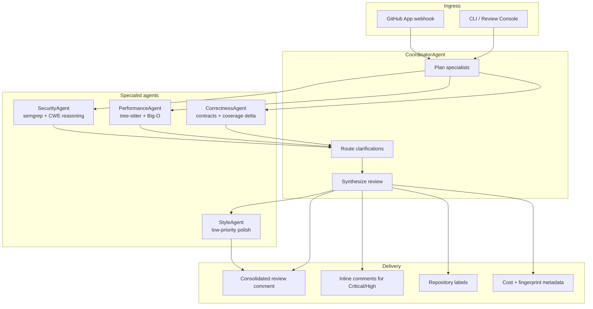
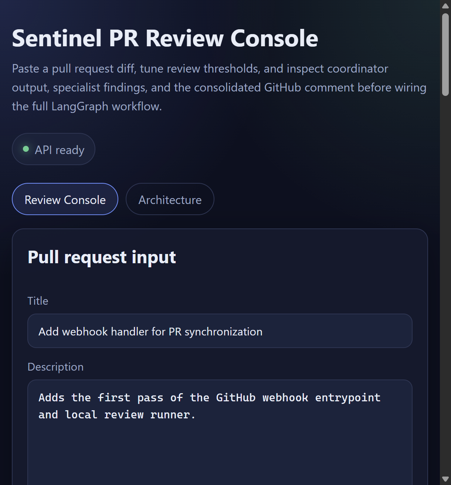

# Sentinel PR Review

Sentinel PR Review is a multi-agent pull request review system that coordinates specialist reviewers for security, performance, correctness, and style. A coordinator agent plans which specialists to run, enforces token budgets, resolves disagreements, and produces a single GitHub-ready review artifact.

The repository currently ships:

- Specialist prompt specifications in `prompts/`
- A local review engine and API in `src/sentinel_pr_review/`
- A browser console for pasting PR metadata and unified diffs
- Architecture notes for the planned LangGraph and GitHub App integration

## Why this exists

Large pull requests mix several review concerns at once. Security issues, performance regressions, logic gaps, and style nits need different evidence and different confidence thresholds. Sentinel models a senior engineering review team as a supervisor-worker graph so high-risk findings surface first and the final GitHub comment stays consolidated.

## Architecture



### Agent responsibilities

| Agent | Primary tools | What it checks |
| --- | --- | --- |
| Coordinator | PR diff, specialist JSON, budgets | Planning, synthesis, conflict resolution, GitHub delivery |
| Security | semgrep OWASP rulesets, contextual reasoning | Injection, secret leakage, auth bypass, unsafe deserialization |
| Performance | tree-sitter AST, complexity reasoning | N+1 queries, unbounded loops, inefficient structures |
| Correctness | docstrings, types, coverage delta | Edge cases, contract drift, untested changed lines |
| Style | repo conventions | Naming, organization, constructive maintainability feedback |

### Runtime guarantees

- Stateful LangGraph orchestration with clarification routing between specialists
- Strict per-agent token budgets enforced by the coordinator
- Confidence thresholding for human review on low-confidence findings
- Retry with exponential backoff and Sonnet-to-Haiku fallback for LLM calls
- Graceful degradation when an individual specialist fails
- Idempotent review fingerprints keyed by commit SHA and deterministic seed

## Quickstart

```bash
python -m venv .venv
.venv\Scripts\activate
pip install -e ".[dev]"
sentinel-review ui
```

Open `http://127.0.0.1:8080` to use the review console.

### CLI review from a diff file

```bash
sentinel-review review --diff path\to\change.diff --title "Auth hardening" --seed 42
```

The command prints structured JSON containing specialist findings, labels, inline-comment candidates, and the consolidated GitHub comment preview.

## Review console



The web UI supports:

- PR title, description, and unified diff input
- Confidence threshold and deterministic seed controls
- Specialist agent cards with token usage and findings
- Consolidated GitHub comment preview
- Architecture tab with the same Mermaid supervisor-worker diagram

The current console uses a local heuristic review engine so you can exercise the workflow before LangGraph, semgrep, tree-sitter, and GitHub App wiring are connected.

## Repository layout

```text
docs/                     Architecture notes
prompts/                  Specialist and coordinator prompt specs
src/sentinel_pr_review/   API, review service, and web console
tests/                    Service and API tests
```

## Planned GitHub integration

- GitHub App webhook on pull request open and synchronize events
- One consolidated review comment per run
- Inline comments only for Critical or High findings above the confidence threshold
- Labels such as `needs-security-review` and `performance-concern`
- Cost summary embedded in the final review comment

## Evaluation roadmap

- Benchmark 50 real pull requests with known issues from CVE databases and historical bugs
- Track precision, recall, false positive rate, time-to-review, and cost per PR
- Compare against a single-agent baseline, GitHub Copilot review, and plain Claude review

## Development

```bash
pytest
ruff check src tests
```

## License

MIT
