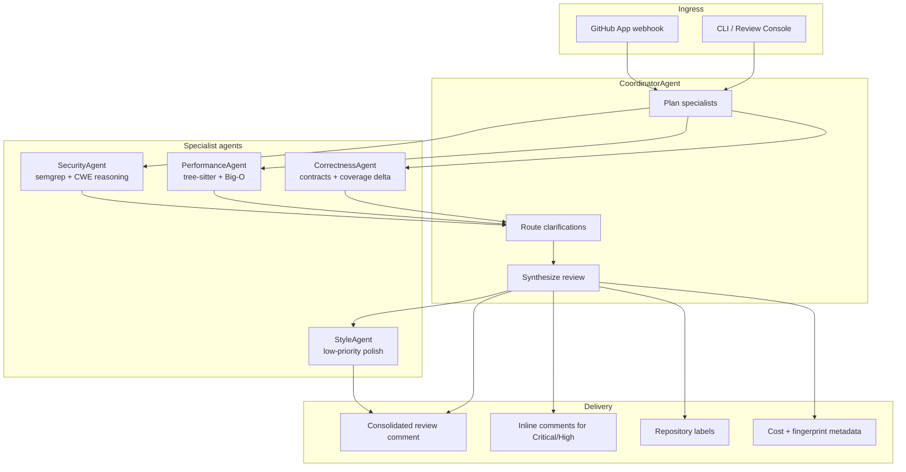

# Sentinel PR Review

Sentinel PR Review is a multi-agent pull request review system that coordinates specialist reviewers for security, performance, correctness, and style. A coordinator agent plans which specialists to run, enforces token budgets, resolves disagreements, and produces a single GitHub-ready review artifact.

The repository currently ships:

- Specialist prompt specifications in `prompts/`
- A local review engine and API in `src/sentinel_pr_review/`
- A browser console for pasting PR metadata and unified diffs
- Architecture notes for the planned LangGraph and GitHub App integration

## Why this exists

Large pull requests mix several review concerns at once. Security issues, performance regressions, logic gaps, and style nits need different evidence and different confidence thresholds. Sentinel models a senior engineering review team as a supervisor-worker graph so high-risk findings surface first and the final GitHub comment stays consolidated.

## Architecture



### Agent responsibilities

| Agent | Primary tools | What it checks |
| --- | --- | --- |
| Coordinator | PR diff, specialist JSON, budgets | Planning, synthesis, conflict resolution, GitHub delivery |
| Security | semgrep OWASP rulesets, contextual reasoning | Injection, secret leakage, auth bypass, unsafe deserialization |
| Performance | tree-sitter AST, complexity reasoning | N+1 queries, unbounded loops, inefficient structures |
| Correctness | docstrings, types, coverage delta | Edge cases, contract drift, untested changed lines |
| Style | repo conventions | Naming, organization, constructive maintainability feedback |

### Runtime guarantees

- Stateful LangGraph orchestration with clarification routing between specialists
- Strict per-agent token budgets enforced by the coordinator
- Confidence thresholding for human review on low-confidence findings
- Retry with exponential backoff and Sonnet-to-Haiku fallback for LLM calls
- Graceful degradation when an individual specialist fails
- Idempotent review fingerprints keyed by commit SHA and deterministic seed

## Quickstart

```bash
python -m venv .venv
.venv\Scripts\activate
pip install -e ".[dev]"
sentinel-review ui
```

Open `http://127.0.0.1:8080` to use the review console.

### CLI review from a diff file

```bash
sentinel-review review --diff path\to\change.diff --title "Auth hardening" --seed 42
```

The command prints structured JSON containing specialist findings, labels, inline-comment candidates, and the consolidated GitHub comment preview.

## Review console


The web UI supports:

- PR title, description, and unified diff input
- Confidence threshold and deterministic seed controls
- Specialist agent cards with token usage and findings
- Consolidated GitHub comment preview
- Architecture tab with the same Mermaid supervisor-worker diagram

The web UI runs the same LangGraph review pipeline as the API, including optional LLM specialists when `ANTHROPIC_API_KEY` is set.

## GitHub App

Production webhook setup, permissions, and environment variables are documented in [docs/github-app-deployment.md](docs/github-app-deployment.md).

## Benchmarks and ground truth

Harvest merged pull requests (includes `github_pr` for Copilot baseline):

```bash
sentinel-review harvest --repo owner/repo --limit 50 --output benchmarks/real_manifest.json
```

Merge CVE, GHSA, or bug labels from a sidecar JSON (map keyed by case `id`, or a list of objects with `id`):

```bash
sentinel-review annotate --manifest benchmarks/real_manifest.json --ground-truth benchmarks/ground_truth.example.json --output benchmarks/real_manifest.labeled.json
```

Run the harness with optional overlay (without writing a merged file):

```bash
sentinel-review benchmark --manifest benchmarks/real_manifest.json --ground-truth benchmarks/ground_truth.example.json --output benchmarks/results/latest.json
```

Metrics treat a case as **labeled** when `known_issues`, `cve_ids`, or `bug_references` is non-empty. Detection matches if any of those strings (or the numeric CVE suffix) appears in finding titles or evidence. The **copilot** baseline calls `gh api` for pull request reviews authored by Copilot when `github_pr` is set and the GitHub CLI is installed; otherwise it behaves like an empty review.

## Repository layout

```text
benchmarks/               Sample manifest, ground truth example, results
docs/                     Architecture and GitHub App deployment
prompts/                  Specialist and coordinator prompt specs
src/sentinel_pr_review/   API, review service, LangGraph, and web console
tests/                    Service and API tests
```

## GitHub integration (implemented)

- GitHub App webhook on pull request open and synchronize events (`/api/github/webhook`)
- Consolidated PR comment, labels, inline review comments for Critical/High
- Idempotent repost skipped when the same review fingerprint is already present

## Evaluation roadmap

- Replace synthetic diffs with real PRs tied to CVE/GHSA databases using `annotate` and curated `ground_truth` files
- Track precision, recall, false positive rate, time-to-review, and cost per PR across `sentinel`, `single_agent`, `plain_claude`, and `copilot` baselines

## Development

```bash
pytest
ruff check src tests
```

## License

MIT
