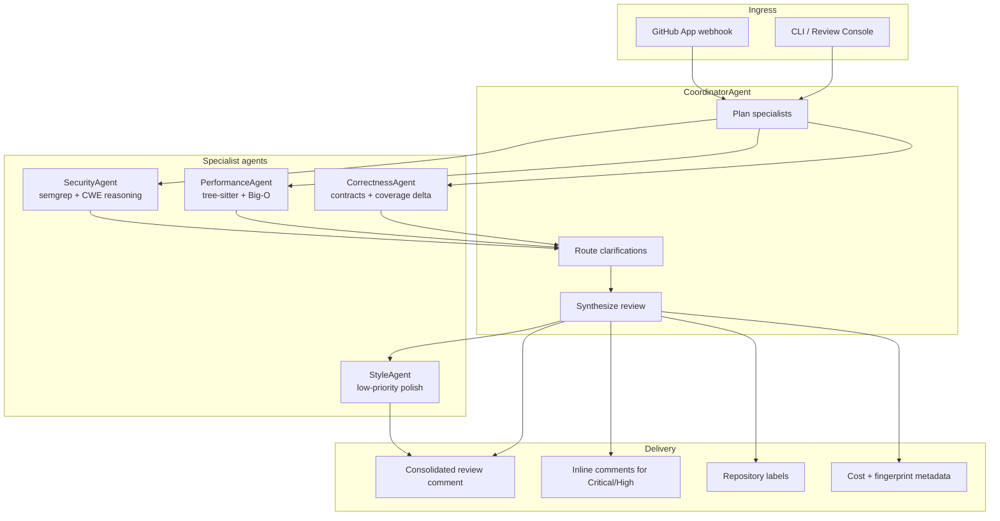

# Architecture

## Pattern

Supervisor-worker orchestration with a Coordinator agent and four specialists: Security, Performance, Correctness, and Style.

## System diagram

## Planned graph

- Stateful LangGraph workflow with shared PR context
- Specialists may emit clarification requests routed by the Coordinator
- Per-agent token budgets enforced at dispatch and synthesis
- Confidence threshold routes low-confidence items to human review
- LLM calls use retry with exponential backoff; fallback from Sonnet to Haiku on rate limits
- Partial failures degrade gracefully; successful agents still contribute

## Interactive console

The FastAPI-backed review console in `src/sentinel_pr_review/static/` exposes the same review contract locally. It is the current day-one interaction surface while GitHub App delivery is still under construction.

## GitHub surface

- Webhook on pull request open and synchronize
- One consolidated review comment per run
- Inline comments only for Critical or High findings above confidence threshold
- Labels such as `needs-security-review` and `performance-concern`
- Cost summary embedded in the final comment
- Idempotent output keyed by commit SHA and deterministic seed

## Evaluation (planned)

- Benchmark of 50 real pull requests with known issues
- Metrics: precision, recall, false positive rate, time-to-review, cost per PR
- Baselines: single-agent, Copilot review, plain Claude review

## Repository layout

- `prompts/`: agent specifications
- `src/sentinel_pr_review/`: runtime package, API, and web console
- `tests/`: API and review-service coverage
